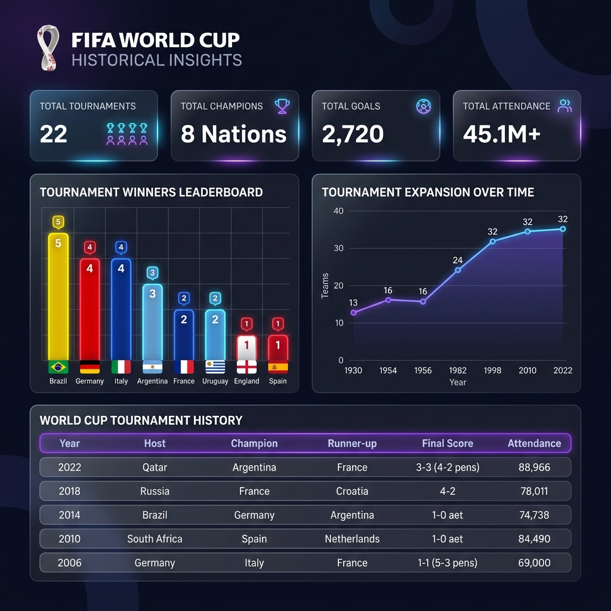

# FIFA World Cup Data Scraper

A robust, dynamic, and high-performance Python-based web scraper that extracts, cleans, and exports historical FIFA World Cup tournament data from Wikipedia using **Playwright** and **Pandas**. Part of **Task 1** for CodeAlpha.



---

## 🚀 Key Features

* **Dynamic Table Detection**: Automatically inspects all tables on the Wikipedia page to locate the correct tournament history table using key headers (`Champion`, `Runner-up`, `Third Place`), making it resilient to website layout updates.
* **Comprehensive Data Extraction**: Scrapes all 10 structural columns, including Champion, Score, Runner-up, Third Place, Third Place Score, Fourth Place, Host, Year, and number of Teams.
* **Data Normalization & Footnote Removal**: Automatically standardizes wide unicode dashes (e.g., `–`, `—`) into standard hyphens (`-`), strips Wikipedia citation brackets (e.g., `[n 1]`, `[1]`), and trims whitespace.
* **Robust Row Filtering**: Smart detection of cancelled tournaments (e.g., 1942 and 1946 due to World War II) and graceful processing of future scheduled editions (e.g., 2026, 2030, 2034).
* **Excel Compatibility**: Exports cleaner data to CSV with `utf-8-sig` encoding to prevent encoding issues when viewing special characters in Microsoft Excel.

---

## 🛠️ Tech Stack

* **Core Language**: Python 3
* **Automation & Scraping**: Playwright (Headless Chromium)
* **Data Manipulation**: Pandas
* **Pattern Matching**: Regular Expressions (Regex)

---

## 📁 Repository Structure

* `fifa_scraper.py` — The core Python script that implements the scraping, cleaning, and exporting logic.
* `fifa_world_cup_stats.csv` — The generated CSV file containing all scraped and normalized tournament records.
* `requirements.txt` — Project dependencies (Playwright and Pandas).
* `screenshot.png` — Visual preview of the project and scraped data dashboard.

---

## ⚙️ Installation & Usage

### 1. Clone the repository
Navigate to your project folder:
```bash
cd CODEALPHA_YUVATHILAGAN_TASK1
```

### 2. Install dependencies
Install the required packages from `requirements.txt`:
```bash
pip install -r requirements.txt
```

### 3. Install Playwright Browsers
Install the headless browser binaries required by Playwright:
```bash
playwright install
```

### 4. Run the Scraper
Execute the script to start the web scraper:
```bash
python fifa_scraper.py
```

Upon successful execution, the script will print a preview of the dataset to the console and save the complete results to `fifa_world_cup_stats.csv`.

---

## 📊 Extracted Data Schema

The scraper exports a CSV file containing the following fields:

| Field Name | Description | Example |
| :--- | :--- | :--- |
| **Edition** | The numerical order of the World Cup tournament | `1`, `21`, `22` |
| **Year** | The year the tournament was held | `1930`, `2022`, `2026` |
| **Host** | The host nation(s) of the tournament | `Uruguay`, `South Korea Japan`, `Canada Mexico United States` |
| **Champion** | The winning national team | `Uruguay`, `Argentina`, `France` |
| **Score** | The final match score of the first-place game | `4-2`, `3-3 (a.e.t.) (4-2 p)` |
| **Runner-up** | The second-place national team | `Argentina`, `France`, `Croatia` |
| **Third Place** | The third-place national team | `United States`, `Germany`, `Croatia` |
| **Third Place Score**| The final match score of the third-place game | `3-2`, `2-1`, `-` |
| **Fourth Place** | The fourth-place national team | `Yugoslavia`, `Austria`, `Morocco` |
| **Teams** | The number of participating national teams | `13`, `32`, `48` |

---

*Developed with ❤️ by Yuvathilagan.*
